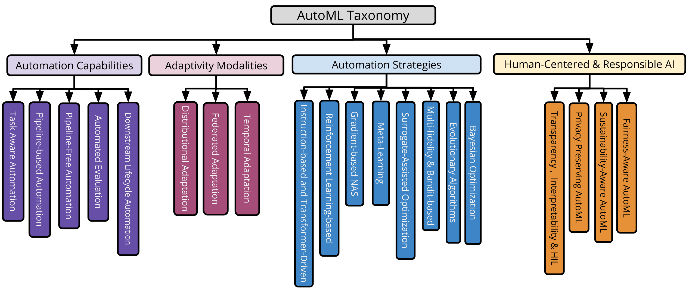
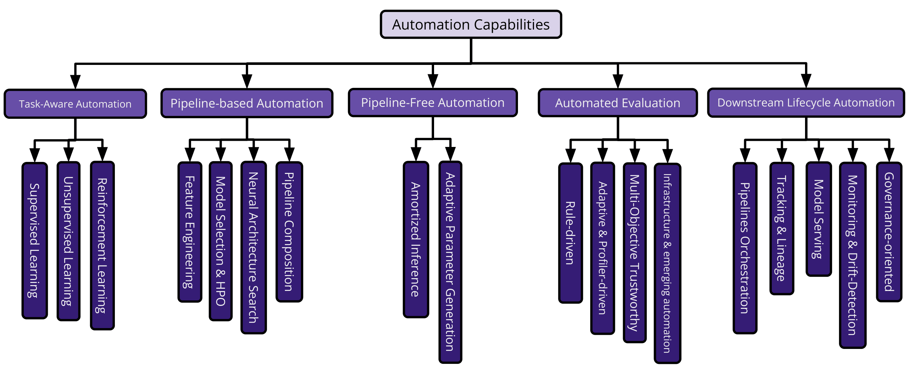
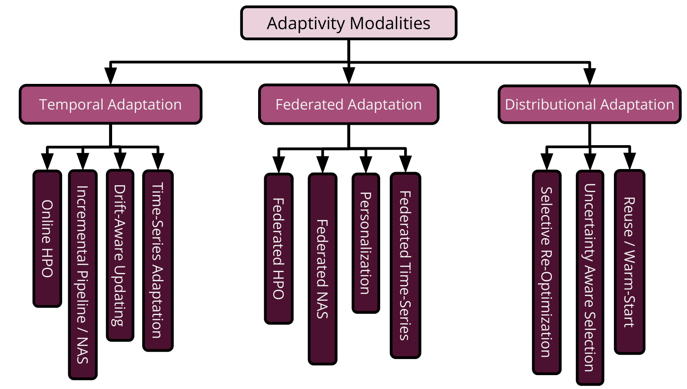
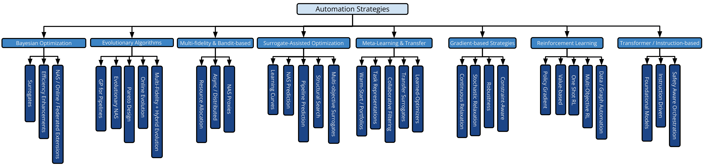
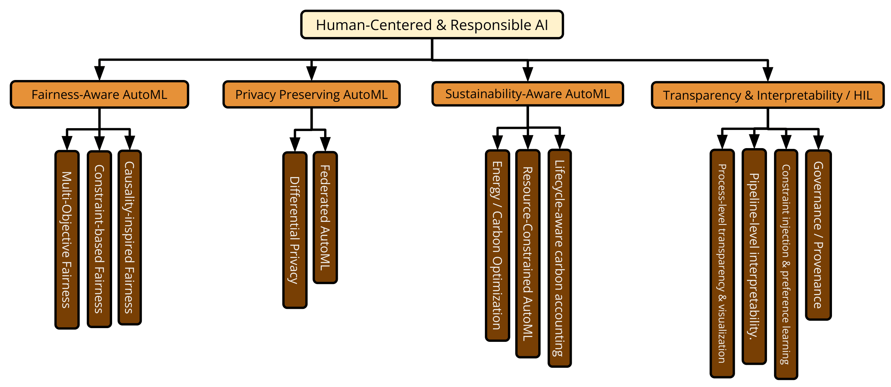

# Beyond the Static Horizon: A Survey of Automated Machine Learning

<p align="center">
  <b>An extensive reading guide and taxonomy companion for the AutoML survey manuscript.</b><br/>
  <i>Radwa El Shawi, Mohamed Maher, and Amin Beheshti</i>
</p>

<p align="center">
  
  
  
  
  
</p>

---

## 🔎 What this repository is

This repository accompanies the manuscript **“Beyond the Static Horizon: A Survey of Automated Machine Learning.”** The README is designed as a living guide to the paper rather than only a file index. It summarizes the survey protocol, reconstructs the taxonomy, organizes the cited literature, and provides compact comparison tables across the main AutoML dimensions.

The manuscript argues that modern AutoML is no longer only a static black-box optimization problem. AutoML now includes adaptive systems for streams and time series, federated and decentralized optimization, pipeline-free inference using foundation models, automated evaluation and MLOps, and responsible-AI constraints such as fairness, privacy, transparency, and sustainability.

> **Figure placeholder:** add the manuscript taxonomy figure here, for example: `assets/automl_taxonomy.png`.
>
> 
## 🧭 Survey snapshot

| Item | Description |
|---|---|
| **Manuscript title** | Beyond the Static Horizon: A Survey of Automated Machine Learning |
| **Authors** | Radwa El Shawi, Mohamed Maher, Amin Beheshti |
| **Review period** | 2016 to March 2026 |
| **Search date** | March 1, 2026 |
| **Screened abstracts** | 6,152 |
| **Retrieved full texts** | 1,620 |
| **Final included primary studies** | 202 |
| **Main contribution** | A four-dimensional taxonomy that connects classical AutoML with adaptive, federated, pipeline-free, and responsible AutoML. |
| **Core dimensions** | Automation capabilities, adaptivity modalities, automation strategies, and human-centered/responsible AutoML. |
## 🧩 Four-dimensional taxonomy

| Dimension | Main question | Second-level categories | Representative references |
|---|---|---|---|
| **Automation capabilities** | What parts of the ML lifecycle are automated? | Task-aware scope; pipeline-based automation; pipeline-free automation; automated evaluation; downstream lifecycle operations. | Automated machine learning: State-of-the-art and open challenges (2019)<br>Auto-WEKA 2.0: Automatic model selection and hyperparameter optimization in WEKA (2017)<br>Automated machine learning: past, present and future (2024)<br>TabPFN: A Transformer That Solves Small Tabular Classification Problems in a Single Forward Pass (2023)<br>Fair-AutoML: Bias-Aware Automation in Machine Learning (2024)<br>A Review on Interplay of AutoML and MLOps “AutoMLOps”: Current State, Challenges, and Future Scope (2025) |
| **Adaptivity modalities** | When and why should AutoML update under change? | Temporal adaptation; federated adaptation; distributional adaptation. | Flora: Single-shot hyper-parameter optimization for federated learning (2021)<br>Review of ML and AutoML solutions to forecast time-series data (2022)<br>AutoGluon--TimeSeries: AutoML for probabilistic time series forecasting (2023)<br>Direct Federated Neural Architecture Search (2020)<br>Personalized federated learning: A meta-learning approach (2020)<br>A Baseline for Detecting Misclassified and Out-of-Distribution Examples in Neural Networks (2017)<br>Adaptation strategies for automated machine learning on evolving data (2021) |
| **Automation strategies** | How does AutoML search, optimize, transfer, or infer? | Bayesian optimization; evolutionary algorithms; multi-fidelity and bandit-based optimization; surrogate-assisted optimization; meta-learning; gradient-based NAS; reinforcement learning; transformer/instruction-based orchestration. | Practical bayesian optimization of machine learning algorithms (2012)<br>BOHB: Robust and efficient hyperparameter optimization at scale (2018)<br>Hyperband: A novel bandit-based approach to hyperparameter optimization (2018)<br>ADELA: Surrogate-assisted evolutionary pipeline optimization (2025)<br>Meta-learning: A survey (2019)<br>DARTS: Differentiable Architecture Search (2019)<br>Efficient neural architecture search via parameters sharing (2018)<br>AutoML-GPT: Instruction-Tuned Large Language Models for Automated Machine Learning (2023) |
| **Human-centered and responsible AutoML** | Which constraints and oversight mechanisms shape automated decisions? | Fairness; privacy; sustainability; transparency; interpretability; human-in-the-loop control. | Fair-AutoML: Bias-Aware Automation in Machine Learning (2024)<br>Smpai: Secure multi-party computation for federated learning (2019)<br>[Green AI](https://doi.org/10.1145/3351449) (2019)<br>[Towards Green AutoML: Optimizing for Energy Efficiency and Carbon Footprint](https://arxiv.org/abs/2306.00000) (2023)<br>[Human-Centered Approaches for Provenance in Automated Data Science (Dagstuhl Seminar 23372)](https://doi.org/10.4230/DagRep.13.9.116) (2024)<br>[Position: A Call to Action for a Human-Centered AutoML Paradigm](https://arxiv.org/pdf/2406.03348) (2024) |
## ❓ Research questions

| RQ | Focus | Search intent |
|---|---|---|
| **RQ1** | Automation scope and lifecycle depth | Compare pipeline components, feature engineering, model selection, HPO, NAS, pipeline composition, and end-to-end automation. |
| **RQ2** | Adaptivity in dynamic settings | Study streaming, time-series, online, continual, federated, decentralized, personalized, and drift-aware AutoML. |
| **RQ3** | Algorithmic strategies | Compare BO, evolutionary search, multi-fidelity, bandits, surrogates, meta-learning, gradient-based search, RL, transformers, and LLMs. |
| **RQ4** | Human-centered and responsible AutoML | Analyze fairness, privacy, interpretability, explainability, human-in-the-loop control, sustainability, and governance. |
## 📚 Positioning against prior AutoML surveys

| Survey family | Main scope | Learning contexts | Main strengths | Main limitation relative to this survey | References |
|---|---|---|---|---|---|
| Foundational AutoML surveys | General AutoML, HPO, model selection, CASH, and NAS | Mostly static and centralized | Establish the conceptual basis of AutoML and classical search spaces. | Limited treatment of streaming, federated, distributional, and responsible AutoML. | Taking human out of learning applications: A survey on automated machine learning (2018)<br>Automated machine learning: State-of-the-art and open challenges (2019)<br>Automated machine learning: past, present and future (2024) |
| Taxonomy and framework analyses | Search spaces, meta-learning, HPO, and NAS taxonomies | Mostly static | Provide fine-grained classification of classical AutoML mechanisms. | Less integrated coverage of dynamic settings and lifecycle governance. | Automl to date and beyond: Challenges and opportunities (2021)<br>Eight years of AutoML: categorisation, review and trends (2023)<br>[A systematic literature review on AutoML for multi-target learning tasks](https://doi.org/10.1007/s10462-023-10569-2) (2023) |
| NAS-centered surveys | Neural architecture search | Mostly supervised and static | Deep coverage of search spaces, performance predictors, differentiable search, and weight sharing. | Narrower focus on architecture search rather than full AutoML lifecycle. | AutoML: A survey of the state-of-the-art (2021)<br>AutoML: A systematic review on automated machine learning with neural architecture search (2024) |
| Time-series AutoML surveys | Automated forecasting and temporal models | Temporal / time series | Specialized depth for forecasting tasks. | Adaptation and drift-handling are not treated as a general AutoML dimension. | Review of ML and AutoML solutions to forecast time-series data (2022) |
| Clustering AutoML surveys | Automated clustering and unsupervised HPO | Static unsupervised learning | Good coverage of clustering-specific objectives and search spaces. | Limited coverage of supervised, temporal, federated, or responsible AutoML. | A survey on automl methods and systems for clustering (2024) |
| Tertiary analyses | Survey-of-surveys synthesis | High-level synthesis | Useful meta-view over existing reviews. | Does not introduce a new operational taxonomy across AutoML artifacts. | [AutoML: A Tertiary Study of Phases, Methods, Tools, and Frameworks](https://doi.org/10.1007/978-3-032-04403-7_26) (2025) |
| **This survey** | Unified AutoML across static, dynamic, federated, and responsible settings | Static, streaming, time-series, federated, edge, and distribution-shift contexts | Connects capabilities, adaptivity, strategies, and responsible-AI constraints in a single comparison framework. | Intended as a broad synthesis; specialized subfields may still require deeper dedicated surveys. | — |
## 🧪 Review protocol

| Stage | Procedure |
|---|---|
| **Planning** | Research questions were aligned with the four-dimensional taxonomy and the review protocol followed a structured planning, conducting, and reporting process. |
| **Search sources** | Google Scholar, IEEE Xplore, Scopus, and SpringerLink. |
| **Deduplication** | DOI and title matching followed by manual verification. |
| **Abstract screening** | 6,152 abstracts were screened against the inclusion and exclusion criteria. |
| **Full-text screening** | 1,620 papers were examined for substantive methodological, algorithmic, system-level, or responsible-AI contribution. |
| **Final corpus** | 202 primary studies published between 2016 and March 2026. |

### Inclusion and exclusion criteria

| Included | Excluded |
|---|---|
| Peer-reviewed journal and conference papers; widely cited preprints where no archival version was available. | Technical reports, non-archival workshop papers, supplementary material, and grey literature. |
| Papers proposing, implementing, or evaluating AutoML methods, systems, or algorithms. | Papers where AutoML is only mentioned tangentially. |
| Contributions to at least one taxonomy dimension. | Papers without substantive automation-related content. |
| Publications from 2016 to March 2026. | Publications before 2016. |
| English-language publications. | Non-English publications. |
## 🛠️ Detailed guide by taxonomy dimension

### 1. Automation capabilities

| Category | What is automated? | Typical mechanisms | Representative artifacts and references |
|---|---|---|---|
| **Task-aware scope** | The adaptation of AutoML design to supervised, unsupervised, reinforcement-learning, time-series, graph, or tabular tasks. | Task-specific search spaces, proxy objectives, metric selection, and task-conditioned recommendations. | Benchmark and survey of automated machine learning frameworks (2021)<br>[AutoGL: A Library for Automated Graph Learning](https://github.com/THUMNLab/AutoGL) (2023)<br>AutoRL: Automated Feature Engineering via Reinforcement Learning (2021)<br>Gama: A general automated machine learning assistant (2020) |
| **Feature engineering** | Feature construction, transformation, selection, and representation design. | DFS, symbolic transformations, learned feature transformations, LLM-guided feature proposals. | BigFeat: Scalable and Interpretable Automated Feature Engineering Framework (2023)<br>Large language models for automated data science: Introducing caafe for context-aware automated feature engineering (2023)<br>Data interpreter: An llm agent for data science (2025) |
| **Model selection and HPO / CASH** | Joint selection of learning algorithms and hyperparameters. | SMAC, TPE, BOHB, Hyperband, evolutionary search, and low-cost optimization. | Algorithms for hyper-parameter optimization (2011)<br>Sequential model-based optimization for general algorithm configuration (2011)<br>Auto-WEKA 2.0: Automatic model selection and hyperparameter optimization in WEKA (2017)<br>Auto-sklearn 2.0: Hands-free automl via meta-learning (2022)<br>BOHB: Robust and efficient hyperparameter optimization at scale (2018)<br>FLAML: A fast and lightweight AutoML library (2021) |
| **Neural architecture search** | Architecture topology, operations, cell structures, and neural network hyperparameters. | RL, evolutionary NAS, differentiable NAS, weight sharing, predictors, and one-shot supernets. | [Designing Neural Network Architectures using Reinforcement Learning](https://openreview.net/forum?id=S1c2cvqee) (2017)<br>Efficient neural architecture search via parameters sharing (2018)<br>[Regularized Evolution for Image Classifier Architecture Search](https://doi.org/10.1609/aaai.v33i01.33014780) (2019)<br>DARTS: Differentiable Architecture Search (2019)<br>[Once for All: Train One Network and Specialize it for Efficient Deployment](https://arxiv.org/pdf/1908.09791.pdf) (2020)<br>Bananas: Bayesian optimization with neural architectures for neural architecture search (2021) |
| **Pipeline composition** | End-to-end workflow construction from preprocessing to model fitting and evaluation. | Grammar-based search, hierarchical planning, pipeline templates, meta-learning, and agentic orchestration. | Evaluation of a tree-based pipeline optimization tool for automating data science (2016)<br>[GAMA: A Genetic Automated Machine Learning Assistant](https://doi.org/10.21105/joss.01132) (2019)<br>ML-Plan: Automated Machine Learning via Hierarchical Planning (2018)<br>[AlphaD3M: Machine Learning Pipeline Synthesis](https://arxiv.org/abs/2111.02508) (2021)<br>AutoML-GPT: Instruction-Tuned Large Language Models for Automated Machine Learning (2023)<br>[AutoM3L: An Automated Multimodal Machine Learning Framework with Large Language Models](https://arxiv.org/abs/2408.00665) (2024) |
| **Pipeline-free automation** | Prediction or configuration generation without conventional iterative search. | Foundation models, in-context learning, amortized inference, and adaptive parameter generation. | TabPFN: A Transformer That Solves Small Tabular Classification Problems in a Single Forward Pass (2023)<br>MTFormer: Multi-Task Learning via Transformer and Cross-Task Reasoning (2022)<br>Towards learning universal hyperparameter optimizers with transformers (2022)<br>TabICL: A Tabular Foundation Model for In-Context Learning on Large Data (n.d.)<br>HyperLoRA: Efficient Cross-task Generalization via Constrained Low-Rank Adapters Generation (2024) |
| **Automated evaluation** | Evaluation design, diagnostics, fairness checks, reliability estimation, uncertainty analysis, and agentic evaluation. | Rule-driven validation, profiler-driven checks, multi-objective assessment, and LLM-assisted evaluation. | AI Fairness 360: An extensible toolkit for detecting and mitigating algorithmic bias (2019)<br>Fairlearn: Assessing and improving fairness of ai systems (2023)<br>Fair-AutoML: Bias-Aware Automation in Machine Learning (2024)<br>ML-EvalPro: Machine Learning Evaluation Profiler for Supervised Tasks (2025)<br>Uncertainty quantification 360: a hands-on tutorial (2022) |
| **Downstream lifecycle operations** | Orchestration, lineage, tracking, CI/CD, deployment, serving, monitoring, drift detection, and governance. | ML pipelines, metadata stores, model registries, monitoring services, and documentation artifacts. | Tfx: A tensorflow-based production-scale machine learning platform (2017)<br>Accelerating the machine learning lifecycle with MLflow. (2018)<br>End-to-end machine learning using kubeflow (2022)<br>Clipper: A $$Low-Latency$$ online prediction serving system (2017)<br>FactSheets: Increasing trust in AI services through supplier's declarations of conformity (2019)<br>Model cards for model reporting (2019) |

> **Figure placeholder:** add `assets/automation_capabilities.png`.
>
> 

### 2. Adaptivity modalities

| Modality | Problem addressed | AutoML implication | Representative references |
|---|---|---|---|
| **Temporal adaptation** | Streams, time series, concept drift, delayed labels, changing seasonality, and online resource constraints. | AutoML must update configurations, models, or pipelines without assuming a stationary objective. | Flora: Single-shot hyper-parameter optimization for federated learning (2021)<br>Review of ML and AutoML solutions to forecast time-series data (2022)<br>AutoGluon--TimeSeries: AutoML for probabilistic time series forecasting (2023)<br>AutoTS: Automated Time Series Forecasting (2023)<br>Online automl: An adaptive automl framework for online learning (2023)<br>Bayesian Stream Tuner: Dynamic Hyperparameter Optimization for Real-Time Data Streams (2025)<br>OSMAC: a dynamic SMAC for data streams (2025) |
| **Federated adaptation** | Cross-client heterogeneity, non-IID data, communication limits, personalization, and privacy constraints. | AutoML must tune globally and locally while reducing communication and protecting client data. | Personalized federated learning: A meta-learning approach (2020)<br>Direct Federated Neural Architecture Search (2020)<br>Flora: Single-shot hyper-parameter optimization for federated learning (2021)<br>[FEATHERS: Federated Architecture and Hyperparameter Search](https://arxiv.org/abs/2206.12342) (2022)<br>[Privacy-Preserving Online AutoML for Domain-Specific Face Detection](https://doi.org/10.48550/arXiv.2203.08399) (2022)<br>[FedForecaster: An Automated Federated Learning Approach for Time-series Forecasting](https://doi.org/10.48786/EDBT.2025.70) (2025) |
| **Distributional adaptation** | Deployment data differ from optimization-time data because of covariate, label, environmental, or domain shifts. | AutoML requires robustness, uncertainty, fallback strategies, and shift-aware evaluation. | A Baseline for Detecting Misclassified and Out-of-Distribution Examples in Neural Networks (2017)<br>Adaptation strategies for automated machine learning on evolving data (2021)<br>Drift-resilient tabPFN: In-context learning temporal distribution shifts on tabular data (2024)<br>GizaML: A Collaborative Meta-learning Based Framework Using LLM For Automated Time-Series Forecasting. (2024) |

> **Figure placeholder:** add `assets/adaptivity_modalities.png`.
>
> 

### 3. Automation strategies

| Strategy | Core idea | Strengths | Limitations | Representative references |
|---|---|---|---|---|
| **Bayesian optimization** | Use a probabilistic surrogate and acquisition function to select promising configurations. | Sample-efficient for expensive black-box objectives. | Can struggle with very high-dimensional, conditional, or non-stationary spaces. | Practical bayesian optimization of machine learning algorithms (2012)<br>Sequential model-based optimization for general algorithm configuration (2011)<br>Fast Bayesian optimization of machine learning hyperparameters on large datasets (2017)<br>SMAC3: A versatile Bayesian optimization package for hyperparameter optimization (2022)<br>Optuna: A next-generation hyperparameter optimization framework (2019) |
| **Evolutionary and genetic algorithms** | Maintain and mutate populations of candidate pipelines, features, or architectures. | Flexible, parallelizable, and naturally handles structured search spaces. | Often computationally expensive without efficiency controls. | Evaluation of a tree-based pipeline optimization tool for automating data science (2016)<br>[Regularized Evolution for Image Classifier Architecture Search](https://doi.org/10.1609/aaai.v33i01.33014780) (2019)<br>DEHB: Evolutionary Hyperband for Scalable, Robust and Efficient Hyperparameter Optimization (2021)<br>[GAMA: A Genetic Automated Machine Learning Assistant](https://doi.org/10.21105/joss.01132) (2019) |
| **Multi-fidelity and bandit-based optimization** | Allocate resources adaptively using partial training, subsets, or early stopping. | Reduces wasted computation and improves anytime behavior. | Low-fidelity rankings may mislead final selection. | Hyperband: A novel bandit-based approach to hyperparameter optimization (2018)<br>BOHB: Robust and efficient hyperparameter optimization at scale (2018)<br>DEHB: Evolutionary Hyperband for Scalable, Robust and Efficient Hyperparameter Optimization (2021)<br>[Once for All: Train One Network and Specialize it for Efficient Deployment](https://arxiv.org/pdf/1908.09791.pdf) (2020) |
| **Surrogate-assisted optimization and performance prediction** | Learn models that predict algorithm or architecture performance. | Supports warm-starting, ranking, and low-cost exploration. | Generalization depends on meta-data quality and benchmark coverage. | OBOE: Collaborative filtering for AutoML model selection (2019)<br>Efficient automl pipeline search with matrix and tensor factorization (2020)<br>Bananas: Bayesian optimization with neural architectures for neural architecture search (2021)<br>ADELA: Surrogate-assisted evolutionary pipeline optimization (2025)<br>AlphaX: Exploring neural architectures with deep reinforcement learning (2019) |
| **Meta-learning and transfer learning** | Reuse prior task experience to initialize, rank, or constrain search. | Improves cold-start performance and reduces search cost. | Sensitive to meta-feature design and task similarity. | Meta-learning: A survey (2019)<br>Auto-sklearn 2.0: Hands-free automl via meta-learning (2022)<br>Dataset2vec: Learning dataset meta-features (2021)<br>[SmartML: A Meta Learning–Based Framework for Automated Selection and Hyperparameter Tuning for Machine Learning Algorithms](https://openproceedings.org/2019/conf/edbt/EDBT19_paper_235.pdf) (2019)<br>Meta-learning acquisition functions for transfer learning in bayesian optimization (2019) |
| **Gradient-based strategies** | Relax discrete architecture choices and optimize via gradients. | Efficient for large NAS spaces and differentiable components. | Can suffer from instability, discretization gap, and search bias. | DARTS: Differentiable Architecture Search (2019)<br>[SNAS: stochastic neural architecture search](https://openreview.net/forum?id=rylqooRqK7) (2019)<br>Searching for a robust neural architecture in four gpu hours (2019)<br>Progressive differentiable architecture search: Bridging the depth gap between search and evaluation (2019)<br>[PC-DARTS: Partial Channel Connections for Memory-Efficient Architecture Search](https://openreview.net/forum?id=BJlS634tPr) (2020)<br>[DrNAS: Dirichlet Neural Architecture Search](https://openreview.net/forum?id=9FWas6YbmB3) (2021) |
| **Reinforcement learning strategies** | Treat configuration or architecture design as sequential decision-making. | Flexible for structured decisions and controller-based NAS. | Expensive training and sensitivity to reward design. | [Designing Neural Network Architectures using Reinforcement Learning](https://openreview.net/forum?id=S1c2cvqee) (2017)<br>Efficient neural architecture search via parameters sharing (2018)<br>Mnasnet: Platform-aware neural architecture search for mobile (2019)<br>[Graph Neural Architecture Search](https://doi.org/10.24963/ijcai.2020/195) (2020) |
| **Transformer and instruction-based orchestration** | Use pretrained models, LLMs, or instruction-tuned agents to propose, compose, or execute AutoML workflows. | Enables amortized inference, natural-language control, and agentic automation. | Reliability, verification, hallucination control, and governance remain open. | TabPFN: A Transformer That Solves Small Tabular Classification Problems in a Single Forward Pass (2023)<br>Towards learning universal hyperparameter optimizers with transformers (2022)<br>AutoML-GPT: Instruction-Tuned Large Language Models for Automated Machine Learning (2023)<br>Large language models for automated data science: Introducing caafe for context-aware automated feature engineering (2023)<br>Data interpreter: An llm agent for data science (2025)<br>[AutoM3L: An Automated Multimodal Machine Learning Framework with Large Language Models](https://arxiv.org/abs/2408.00665) (2024) |

> **Figure placeholder:** add `assets/automation_strategies.png`.
>
> 

### 4. Human-centered and responsible AutoML

| Category | Design objective | How it appears in AutoML | Representative references |
|---|---|---|---|
| **Fairness-aware AutoML** | Optimize performance while controlling group disparity or other fairness criteria. | Multi-objective HPO, fairness constraints, and fairness-aware model selection. | Fair-AutoML: Bias-Aware Automation in Machine Learning (2024)<br>[A Human-in-the-Loop Fairness-Aware Model Selection Framework for Complex Fairness Objective Landscapes](https://ojs.aaai.org/index.php/AIES/article/view/31719) (2024)<br>AI Fairness 360: An extensible toolkit for detecting and mitigating algorithmic bias (2019)<br>Fairlearn: Assessing and improving fairness of ai systems (2023) |
| **Privacy-preserving AutoML** | Protect client data, gradients, or sensitive training information. | Federated HPO, secure aggregation, differential privacy, and privacy-aware NAS. | Direct Federated Neural Architecture Search (2020)<br>Smpai: Secure multi-party computation for federated learning (2019)<br>[FEATHERS: Federated Architecture and Hyperparameter Search](https://arxiv.org/abs/2206.12342) (2022)<br>Flora: Single-shot hyper-parameter optimization for federated learning (2021)<br>[Privacy-Preserving Online AutoML for Domain-Specific Face Detection](https://doi.org/10.48550/arXiv.2203.08399) (2022) |
| **Sustainability-aware AutoML** | Reduce energy, carbon, and resource usage during search and deployment. | Green NAS, energy-aware objectives, resource-constrained search, and carbon tracking. | [Green AI](https://doi.org/10.1145/3351449) (2019)<br>[Towards Green AutoML: Optimizing for Energy Efficiency and Carbon Footprint](https://arxiv.org/abs/2306.00000) (2023)<br>CodeCarbon: Track and Reduce Carbon Emissions from Computing (2025)<br>Mnasnet: Platform-aware neural architecture search for mobile (2019)<br>Proxylessnas: Direct neural architecture search on target task and hardware (2018) |
| **Transparency, interpretability, and HITL** | Make AutoML decisions understandable, auditable, and controllable by humans. | Provenance, explanations, interfaces, constraints, interactive steering, and governance documentation. | [Human-Centered Approaches for Provenance in Automated Data Science (Dagstuhl Seminar 23372)](https://doi.org/10.4230/DagRep.13.9.116) (2024)<br>[Position: A Call to Action for a Human-Centered AutoML Paradigm](https://arxiv.org/pdf/2406.03348) (2024)<br>[ATMSeer: Increasing Transparency and Controllability in Automated Machine Learning](https://arxiv.org/pdf/1902.05009) (2019)<br>[XAutoML: A Visual Analytics Tool for Understanding and Validating Automated Machine Learning](https://arxiv.org/abs/2202.11954) (2023)<br>ixAutoML: Interactive and Explainable AutoML (2025)<br>FactSheets: Increasing trust in AI services through supplier's declarations of conformity (2019)<br>Model cards for model reporting (2019) |

> **Figure placeholder:** add `assets/human_centered_responsible_automl.png`.
>
> 
## 🧾 Cross-dimensional artifact map

The following table converts the manuscript longtable into a compact README format. Codes are preserved where the manuscript uses abbreviated labels.

**Code legend.** SL = supervised learning; UL = unsupervised learning; RL = reinforcement learning; FE = feature engineering; MS/HPO or CASH = model selection and hyperparameter optimization; NAS = neural architecture search; PC = pipeline composition; AI = amortized inference; APG = adaptive parameter generation; RII = retrieval- and instruction-enhanced inference; RD = rule-driven evaluation; AD = adaptive/profiler-driven evaluation; MO = multi-objective trustworthy evaluation; AG = agent-driven evaluation; OR = orchestration; LI = lineage/tracking; CI = continuous integration; SV = serving; MD = monitoring/drift; GV = governance; OH = online HPO; IP = incremental pipeline/architecture adaptation; DU = drift-aware updating; TS = time-series adaptation; FH = federated HPO; FN = federated NAS; FP = federated personalization; FT = federated time-series adaptation; WS = weak/distributional shift robustness; UQ = uncertainty/shift robustness; CP = constrained preference; PG = provenance/governance; PT = process transparency; PI = post-hoc interpretability; CIv = conversational or interactive control.

| Type | Artifact | References | Automation capabilities | Adaptivity modalities | Automation strategies | Responsible AutoML |
|---|---|---|---|---|---|---|
| Algorithm | **FABOLAS** | Fast Bayesian optimization of machine learning hyperparameters on large datasets (2017) | — | — | **Bayesian optimization**: \x; **Multi-fidelity / bandits**: \x | — |
| Benchmark | **EA-HAS-Bench** | [EA-HAS-Bench: Energy-Aware Hyperparameter and Architecture Search Benchmark](https://github.com/microsoft/EA-HAS-Bench) (2023) | **Pipeline-based automation**: NAS | — | **Evolutionary algorithms**: \x | **Sustainability-aware**: \x |
| Benchmark | **EC-NAS** | [EC-NAS: Energy Consumption Aware Tabular Benchmarks for Neural Architecture Search](https://arxiv.org/abs/2210.06015) (2024) | **Pipeline-based automation**: NAS | — | **Gradient-based**: \x | **Sustainability-aware**: \x |
| Foundation Model | **Drift-Resilient TabPFN** | Drift-resilient tabPFN: In-context learning temporal distribution shifts on tabular data (2024) | **Task-aware scope**: SL; **Pipeline-free automation**: AI | **Temporal adaptation**: UQ; **Distributional adaptation**: UQ | **Transformer / instruction-based**: \x | — |
| Foundation Model | **TabICL** | TabICL: A Tabular Foundation Model for In-Context Learning on Large Data (n.d.) | **Task-aware scope**: SL; **Pipeline-free automation**: AI | — | **Transformer / instruction-based**: \x | — |
| Foundation Model | **TabPFN** | TabPFN: A Transformer That Solves Small Tabular Classification Problems in a Single Forward Pass (2023) | **Task-aware scope**: SL; **Pipeline-free automation**: AI | — | **Transformer / instruction-based**: \x | — |
| Framework | **AutoGluon-TimeSeries** | AutoGluon--TimeSeries: AutoML for probabilistic time series forecasting (2023) | **Task-aware scope**: SL; **Pipeline-based automation**: CASH | **Temporal adaptation**: TS | — | — |
| Framework | **AutoM3L** | [AutoM3L: An Automated Multimodal Machine Learning Framework with Large Language Models](https://arxiv.org/abs/2408.00665) (2024) | **Task-aware scope**: SL; **Pipeline-based automation**: FE,PC | — | **Transformer / instruction-based**: \x | **Transparency / HITL**: CIv |
| Framework | **Auto-sklearn** | Auto-sklearn 2.0: Hands-free automl via meta-learning (2022) | **Task-aware scope**: SL; **Pipeline-based automation**: CASH | **Distributional adaptation**: WS | **Bayesian optimization**: \x; **Meta-learning / transfer**: \x | — |
| Framework | **AutoTS** | AutoTS: Automated Time Series Forecasting (2023) | **Task-aware scope**: SL; **Pipeline-based automation**: CASH | **Temporal adaptation**: TS | — | — |
| Framework | **Auto-WEKA** | Auto-WEKA 2.0: Automatic model selection and hyperparameter optimization in WEKA (2017) | **Task-aware scope**: SL; **Pipeline-based automation**: CASH | — | **Bayesian optimization**: \x | — |
| Framework | **BOAT** | BOAT: A bayesian optimization automl time-series framework for industrial applications (2021) | **Task-aware scope**: SL; **Pipeline-based automation**: CASH | **Temporal adaptation**: TS | **Bayesian optimization**: \x | — |
| Framework | **BOHB** | BOHB: Robust and efficient hyperparameter optimization at scale (2018) | **Task-aware scope**: SL; **Pipeline-based automation**: CASH | — | **Bayesian optimization**: \x; **Multi-fidelity / bandits**: \x | — |
| Framework | **CAAFE** | Large language models for automated data science: Introducing caafe for context-aware automated feature engineering (2023) | **Task-aware scope**: SL; **Pipeline-based automation**: FE | — | **Transformer / instruction-based**: \x | **Transparency / HITL**: CIv |
| Framework | **DEHB** | DEHB: Evolutionary Hyperband for Scalable, Robust and Efficient Hyperparameter Optimization (2021) | **Task-aware scope**: SL; **Pipeline-based automation**: CASH | — | **Evolutionary algorithms**: \x; **Multi-fidelity / bandits**: \x | — |
| Framework | **DP-FNAS** | Direct Federated Neural Architecture Search (2020) | **Task-aware scope**: SL; **Pipeline-based automation**: NAS | **Federated adaptation**: FN | — | **Privacy-preserving**: \x |
| Framework | **Fair-AutoML** | Fair-AutoML: Bias-Aware Automation in Machine Learning (2024) | **Task-aware scope**: SL; **Pipeline-based automation**: CASH; **Automated evaluation**: MO | — | **Meta-learning / transfer**: \x | **Fairness-aware**: \x; **Transparency / HITL**: CP |
| Framework | **FEATHERS** | [FEATHERS: Federated Architecture and Hyperparameter Search](https://arxiv.org/abs/2206.12342) (2022) | **Task-aware scope**: SL; **Pipeline-based automation**: NAS | **Federated adaptation**: FN | — | **Privacy-preserving**: \x |
| Framework | **FLAML** | FLAML: A fast and lightweight AutoML library (2021) | **Task-aware scope**: SL; **Pipeline-based automation**: CASH | **Temporal adaptation**: OH | **Multi-fidelity / bandits**: \x | — |
| Framework | **FLoRA** | Flora: Single-shot hyper-parameter optimization for federated learning (2021) | **Task-aware scope**: SL; **Pipeline-based automation**: CASH | **Federated adaptation**: FH,FP | **Meta-learning / transfer**: \x | **Privacy-preserving**: \x |
| Framework | **GAMA** | [GAMA: A Genetic Automated Machine Learning Assistant](https://doi.org/10.21105/joss.01132) (2019) | **Task-aware scope**: SL; **Pipeline-based automation**: FE,CASH,PC | — | **Evolutionary algorithms**: \x | — |
| Framework | **H2O AutoML** | H2O AutoML: Scalable Automatic Machine Learning (2021) | **Task-aware scope**: SL; **Pipeline-based automation**: CASH | — | — | **Transparency / HITL**: PI |
| Framework | **HyperLoRA** | HyperLoRA: Efficient Cross-task Generalization via Constrained Low-Rank Adapters Generation (2024) | **Task-aware scope**: SL; **Pipeline-free automation**: APG | — | **Transformer / instruction-based**: \x | — |
| Framework | **ManyFairHPO** | [A Human-in-the-Loop Fairness-Aware Model Selection Framework for Complex Fairness Objective Landscapes](https://ojs.aaai.org/index.php/AIES/article/view/31719) (2024) | **Task-aware scope**: SL; **Pipeline-based automation**: CASH; **Automated evaluation**: MO | — | **Bayesian optimization**: \x | **Fairness-aware**: \x; **Transparency / HITL**: CP |
| Framework | **MTFormer** | MTFormer: Multi-Task Learning via Transformer and Cross-Task Reasoning (2022) | **Task-aware scope**: SL; **Pipeline-free automation**: AI | — | **Transformer / instruction-based**: \x | — |
| Framework | **Online AutoML** | Online automl: An adaptive automl framework for online learning (2023) | **Task-aware scope**: SL; **Pipeline-based automation**: CASH | **Temporal adaptation**: OH,DU | — | — |
| Framework | **ReCross** | Unsupervised Cross-Task Generalization via Retrieval Augmentation (2022) | **Task-aware scope**: SL; **Pipeline-free automation**: RII | **Distributional adaptation**: WS | **Meta-learning / transfer**: \x; **Transformer / instruction-based**: \x | — |
| Framework | **SmartML** | [SmartML: A Meta Learning–Based Framework for Automated Selection and Hyperparameter Tuning for Machine Learning Algorithms](https://openproceedings.org/2019/conf/edbt/EDBT19_paper_235.pdf) (2019) | **Task-aware scope**: SL; **Pipeline-based automation**: CASH | — | **Meta-learning / transfer**: \x | — |
| Framework | **TPOT** | Evaluation of a tree-based pipeline optimization tool for automating data science (2016) | **Task-aware scope**: SL; **Pipeline-based automation**: FE,PC | — | **Evolutionary algorithms**: \x | — |
| Governance Artifact | **FactSheets** | FactSheets: Increasing trust in AI services through supplier's declarations of conformity (2019) | **Lifecycle operations**: GV | — | — | **Transparency / HITL**: PG |
| Governance Artifact | **Model Cards** | Model cards for model reporting (2019) | **Lifecycle operations**: GV | — | — | **Transparency / HITL**: PG |
| Interface | **ATMSeer** | [ATMSeer: Increasing Transparency and Controllability in Automated Machine Learning](https://arxiv.org/pdf/1902.05009) (2019) | — | — | — | **Transparency / HITL**: PT,CIv |
| Interface | **ixAutoML** | ixAutoML: Interactive and Explainable AutoML (2025) | — | — | — | **Transparency / HITL**: PT,PI,CIv |
| Interface | **XAutoML** | [XAutoML: A Visual Analytics Tool for Understanding and Validating Automated Machine Learning](https://arxiv.org/abs/2202.11954) (2023) | — | — | — | **Transparency / HITL**: PT,PI |
| Library | **AutoGL** | [AutoGL: A Library for Automated Graph Learning](https://github.com/THUMNLab/AutoGL) (2023) | **Task-aware scope**: SL,UL; **Pipeline-based automation**: FE,CASH | — | — | — |
| Library | **autofeat** | — | **Task-aware scope**: SL; **Pipeline-based automation**: FE | — | — | — |
| Library | **Featuretools** | — | **Task-aware scope**: SL; **Pipeline-based automation**: FE | — | — | — |
| Library | **Optuna** | Optuna: A next-generation hyperparameter optimization framework (2019) | **Task-aware scope**: SL; **Pipeline-based automation**: CASH | — | **Bayesian optimization**: \x | — |
| Library | **SMAC3** | SMAC3: A versatile Bayesian optimization package for hyperparameter optimization (2022) | **Task-aware scope**: SL; **Pipeline-based automation**: CASH | — | **Bayesian optimization**: \x; **Surrogate-assisted**: \x | — |
| Method | **AlphaX** | AlphaX: Exploring neural architectures with deep reinforcement learning (2019) | **Pipeline-based automation**: NAS | — | **Surrogate-assisted**: \x; **Reinforcement learning**: \x | — |
| Method | **AutoAugment** | AutoAugment: Learning Augmentation Policies from Data (2019) | **Task-aware scope**: SL; **Pipeline-based automation**: FE | — | **Reinforcement learning**: \x | — |
| Method | **BANANAS** | Bananas: Bayesian optimization with neural architectures for neural architecture search (2021) | **Pipeline-based automation**: NAS | — | **Bayesian optimization**: \x; **Surrogate-assisted**: \x | — |
| Method | **Bayesian Stream Tuner** | Bayesian Stream Tuner: Dynamic Hyperparameter Optimization for Real-Time Data Streams (2025) | **Task-aware scope**: SL; **Pipeline-based automation**: CASH | **Temporal adaptation**: OH,DU | **Bayesian optimization**: \x | — |
| Method | **DARTS** | DARTS: Differentiable Architecture Search (2019) | **Pipeline-based automation**: NAS | — | **Gradient-based**: \x | — |
| Method | **DARTS-** | [DARTS-: Robustly Stepping out of Performance Collapse Without Indicators](https://openreview.net/forum?id=KLH36ELmwIB) (2021) | **Pipeline-based automation**: NAS | — | **Gradient-based**: \x | — |
| Method | **Dataset2Vec** | Dataset2vec: Learning dataset meta-features (2021) | — | — | **Meta-learning / transfer**: \x | — |
| Method | **DrNAS** | [DrNAS: Dirichlet Neural Architecture Search](https://openreview.net/forum?id=9FWas6YbmB3) (2021) | **Pipeline-based automation**: NAS | — | **Gradient-based**: \x | — |
| Method | **ENAS** | Efficient neural architecture search via parameters sharing (2018) | **Pipeline-based automation**: NAS | — | **Multi-fidelity / bandits**: \x; **Reinforcement learning**: \x | — |
| Method | **GDAS** | Searching for a robust neural architecture in four gpu hours (2019) | **Pipeline-based automation**: NAS | — | **Gradient-based**: \x | — |
| Method | **GraphNAS** | [Graph Neural Architecture Search](https://doi.org/10.24963/ijcai.2020/195) (2020) | **Task-aware scope**: SL; **Pipeline-based automation**: NAS | — | **Reinforcement learning**: \x | — |
| Method | **KNAS** | [KNAS: Green Neural Architecture Search](https://proceedings.mlr.press/v139/xu21m.html) (2021) | **Pipeline-based automation**: NAS | — | **Multi-fidelity / bandits**: \x | **Sustainability-aware**: \x |
| Method | **MetaBO** | Meta-learning acquisition functions for transfer learning in bayesian optimization (2019) | — | — | **Bayesian optimization**: \x; **Meta-learning / transfer**: \x | — |
| Method | **MetaQNN** | [Designing Neural Network Architectures using Reinforcement Learning](https://openreview.net/forum?id=S1c2cvqee) (2017) | **Pipeline-based automation**: NAS | — | **Reinforcement learning**: \x | — |
| Method | **MnasNet** | Mnasnet: Platform-aware neural architecture search for mobile (2019) | **Pipeline-based automation**: NAS | — | **Reinforcement learning**: \x | **Sustainability-aware**: \x |
| Method | **NASBOT** | Neural Architecture Search with Bayesian Optimisation and Optimal Transport (2018) | **Pipeline-based automation**: NAS | — | **Bayesian optimization**: \x; **Surrogate-assisted**: \x | — |
| Method | **Once-for-All** | [Once for All: Train One Network and Specialize it for Efficient Deployment](https://arxiv.org/pdf/1908.09791.pdf) (2020) | **Pipeline-based automation**: NAS | — | **Multi-fidelity / bandits**: \x; **Gradient-based**: \x | **Sustainability-aware**: \x |
| Method | **P-DARTS** | Progressive differentiable architecture search: Bridging the depth gap between search and evaluation (2019) | **Pipeline-based automation**: NAS | — | **Gradient-based**: \x | — |
| Method | **PC-DARTS** | [PC-DARTS: Partial Channel Connections for Memory-Efficient Architecture Search](https://openreview.net/forum?id=BJlS634tPr) (2020) | **Pipeline-based automation**: NAS | — | **Gradient-based**: \x | — |
| Method | **Population-Based Training** | A generalized framework for population based training (2019) | **Task-aware scope**: SL,RL; **Pipeline-based automation**: CASH | **Temporal adaptation**: OH,IP | **Evolutionary algorithms**: \x; **Reinforcement learning**: \x | — |
| Method | **ProxylessNAS** | Proxylessnas: Direct neural architecture search on target task and hardware (2018) | **Pipeline-based automation**: NAS | — | **Multi-fidelity / bandits**: \x; **Gradient-based**: \x | **Sustainability-aware**: \x |
| Method | **SNAS** | [SNAS: stochastic neural architecture search](https://openreview.net/forum?id=rylqooRqK7) (2019) | **Pipeline-based automation**: NAS | — | **Gradient-based**: \x | — |
| Model | **OptFormer** | Towards learning universal hyperparameter optimizers with transformers (2022) | — | — | **Meta-learning / transfer**: \x; **Transformer / instruction-based**: \x | — |
| Platform | **Kubeflow Pipelines / MLMD** | End-to-end machine learning using kubeflow (2022) | **Lifecycle operations**: OR,LI | — | — | **Transparency / HITL**: PG |
| Platform | **MLflow** | Accelerating the machine learning lifecycle with MLflow. (2018) | **Lifecycle operations**: LI | — | — | **Transparency / HITL**: PG |
| Platform | **Scanflow-k8s** | Scanflow-k8s: Agent-based framework for autonomic management and supervision of ml workflows in kubernetes clusters (2022) | **Lifecycle operations**: OR,SV,MD | — | — | **Transparency / HITL**: PG |
| Platform | **TFX** | Tfx: A tensorflow-based production-scale machine learning platform (2017) | **Automated evaluation**: RD; **Lifecycle operations**: OR,LI,CI | — | — | **Transparency / HITL**: PG |
| Serving Platform | **Clipper** | Clipper: A $$Low-Latency$$ online prediction serving system (2017) | **Lifecycle operations**: SV | — | — | — |
| System | **Aliro** | Aliro: an automated machine learning tool leveraging large language models (2023) | **Task-aware scope**: SL; **Pipeline-based automation**: PC | — | **Transformer / instruction-based**: \x | **Transparency / HITL**: CIv |
| System | **AlphaD3M** | [AlphaD3M: Machine Learning Pipeline Synthesis](https://arxiv.org/abs/2111.02508) (2021) | **Task-aware scope**: SL; **Pipeline-based automation**: PC | — | **Surrogate-assisted**: \x | — |
| System | **AutoML-GPT** | AutoML-GPT: Instruction-Tuned Large Language Models for Automated Machine Learning (2023) | **Task-aware scope**: SL; **Pipeline-based automation**: PC; **Automated evaluation**: AG | — | **Transformer / instruction-based**: \x | **Transparency / HITL**: CIv |
| System | **DataInterpreter** | Data interpreter: An llm agent for data science (2025) | **Task-aware scope**: SL; **Pipeline-based automation**: FE,PC; **Automated evaluation**: AG | — | **Transformer / instruction-based**: \x | **Transparency / HITL**: CIv |
| System | **FedForecaster** | [FedForecaster: An Automated Federated Learning Approach for Time-series Forecasting](https://doi.org/10.48786/EDBT.2025.70) (2025) | **Task-aware scope**: SL; **Pipeline-based automation**: CASH | **Temporal adaptation**: TS; **Federated adaptation**: FT | **Meta-learning / transfer**: \x | **Privacy-preserving**: \x |
| System | **GizaML** | GizaML: A Collaborative Meta-learning Based Framework Using LLM For Automated Time-Series Forecasting. (2024) | **Task-aware scope**: SL; **Pipeline-based automation**: CASH | **Temporal adaptation**: TS; **Distributional adaptation**: WS | **Meta-learning / transfer**: \x; **Transformer / instruction-based**: \x | — |
| System | **HyperFD** | [Privacy-Preserving Online AutoML for Domain-Specific Face Detection](https://doi.org/10.48550/arXiv.2203.08399) (2022) | **Task-aware scope**: SL; **Pipeline-based automation**: CASH | **Temporal adaptation**: OH; **Federated adaptation**: FH | **Meta-learning / transfer**: \x | **Privacy-preserving**: \x |
| System | **ML-Plan** | ML-Plan: Automated Machine Learning via Hierarchical Planning (2018) | **Task-aware scope**: SL; **Pipeline-based automation**: PC | — | — | — |
| System | **OBOE** | OBOE: Collaborative filtering for AutoML model selection (2019) | **Task-aware scope**: SL; **Pipeline-based automation**: CASH | **Distributional adaptation**: WS | **Surrogate-assisted**: \x; **Meta-learning / transfer**: \x | — |
| System | **TensorOboe** | Efficient automl pipeline search with matrix and tensor factorization (2020) | **Task-aware scope**: SL; **Pipeline-based automation**: CASH,PC | **Distributional adaptation**: WS | **Surrogate-assisted**: \x; **Meta-learning / transfer**: \x | — |
| Tool | **CodeCarbon** | CodeCarbon: Track and Reduce Carbon Emissions from Computing (2025) | **Lifecycle operations**: GV | — | — | **Sustainability-aware**: \x; **Transparency / HITL**: PG |
| Tool | **DVC** | DVC in Open Source ML-development: The Action and the Reaction (2024) | **Lifecycle operations**: LI | — | — | **Transparency / HITL**: PG |
| Toolkit | **AIF360** | AI Fairness 360: An extensible toolkit for detecting and mitigating algorithmic bias (2019) | **Automated evaluation**: MO | — | — | **Fairness-aware**: \x; **Transparency / HITL**: PI |
| Toolkit | **Alibi Explain** | Alibi explain: Algorithms for explaining machine learning models (2021) | **Automated evaluation**: MO | — | — | **Transparency / HITL**: PI |
| Toolkit | **Deequ** | Deequ-data quality validation for machine learning pipelines (2018)<br>Unit testing data with deequ (2019) | **Automated evaluation**: RD; **Lifecycle operations**: OR,GV | — | — | **Transparency / HITL**: PG |
| Toolkit | **Fairlearn** | Fairlearn: Assessing and improving fairness of ai systems (2023) | **Automated evaluation**: MO | — | — | **Fairness-aware**: \x; **Transparency / HITL**: PI |
| Toolkit | **ML-EvalPro** | ML-EvalPro: Machine Learning Evaluation Profiler for Supervised Tasks (2025) | **Task-aware scope**: SL; **Automated evaluation**: AD,MO | — | — | **Fairness-aware**: \x; **Transparency / HITL**: PI |
| Toolkit | **UQ360** | Uncertainty quantification 360: a hands-on tutorial (2022) | **Automated evaluation**: MO | **Distributional adaptation**: UQ | — | **Transparency / HITL**: PI |

## 🗂️ Reading map by literature cluster

| Cluster | Why it matters | Representative references |
|---|---|---|
| **Feature engineering and pipeline composition** | Shows how AutoML constructs end-to-end workflows rather than only tuning isolated estimators. | [GAMA: A Genetic Automated Machine Learning Assistant](https://doi.org/10.21105/joss.01132) (2019)<br>Evaluation of a tree-based pipeline optimization tool for automating data science (2016)<br>ML-Plan: Automated Machine Learning via Hierarchical Planning (2018)<br>[AlphaD3M: Machine Learning Pipeline Synthesis](https://arxiv.org/abs/2111.02508) (2021)<br>Auto-Keras: An Efficient Neural Architecture Search System (2019) |
| **Model selection and HPO / CASH** | Forms the classical core of AutoML and remains essential for tabular and structured data. | Algorithms for hyper-parameter optimization (2011)<br>Sequential model-based optimization for general algorithm configuration (2011)<br>Auto-WEKA 2.0: Automatic model selection and hyperparameter optimization in WEKA (2017)<br>Auto-sklearn 2.0: Hands-free automl via meta-learning (2022)<br>Optuna: A next-generation hyperparameter optimization framework (2019)<br>SMAC3: A versatile Bayesian optimization package for hyperparameter optimization (2022)<br>FLAML: A fast and lightweight AutoML library (2021)<br>H2O AutoML: Scalable Automatic Machine Learning (2021) |
| **Neural architecture search** | Automates deep model design and provides many of the efficiency challenges that shaped modern AutoML. | [Designing Neural Network Architectures using Reinforcement Learning](https://openreview.net/forum?id=S1c2cvqee) (2017)<br>Efficient neural architecture search via parameters sharing (2018)<br>[Regularized Evolution for Image Classifier Architecture Search](https://doi.org/10.1609/aaai.v33i01.33014780) (2019)<br>DARTS: Differentiable Architecture Search (2019)<br>[SNAS: stochastic neural architecture search](https://openreview.net/forum?id=rylqooRqK7) (2019)<br>Searching for a robust neural architecture in four gpu hours (2019)<br>[DrNAS: Dirichlet Neural Architecture Search](https://openreview.net/forum?id=9FWas6YbmB3) (2021)<br>AutoML: A survey of the state-of-the-art (2021) |
| **Pipeline-free / amortized AutoML** | Represents the shift from explicit search toward pretrained models and in-context inference. | TabPFN: A Transformer That Solves Small Tabular Classification Problems in a Single Forward Pass (2023)<br>MTFormer: Multi-Task Learning via Transformer and Cross-Task Reasoning (2022)<br>Towards learning universal hyperparameter optimizers with transformers (2022)<br>TabICL: A Tabular Foundation Model for In-Context Learning on Large Data (n.d.)<br>Drift-resilient tabPFN: In-context learning temporal distribution shifts on tabular data (2024)<br>HyperLoRA: Efficient Cross-task Generalization via Constrained Low-Rank Adapters Generation (2024) |
| **LLM and instruction-based orchestration** | Connects AutoML with agentic systems and natural-language workflow control. | AutoML-GPT: Instruction-Tuned Large Language Models for Automated Machine Learning (2023)<br>Large language models for automated data science: Introducing caafe for context-aware automated feature engineering (2023)<br>Data interpreter: An llm agent for data science (2025)<br>[AutoM3L: An Automated Multimodal Machine Learning Framework with Large Language Models](https://arxiv.org/abs/2408.00665) (2024)<br>[OmniForce: On Human-Centered, Large Model Empowered and Cloud-Edge Collaborative AutoML System](https://doi.org/10.1038/s44387-025-00002-0) (2025) |
| **Automated evaluation and MLOps** | Extends AutoML from model construction into validation, deployment, monitoring, and lifecycle governance. | Fair-AutoML: Bias-Aware Automation in Machine Learning (2024)<br>ML-EvalPro: Machine Learning Evaluation Profiler for Supervised Tasks (2025)<br>Tfx: A tensorflow-based production-scale machine learning platform (2017)<br>Accelerating the machine learning lifecycle with MLflow. (2018)<br>End-to-end machine learning using kubeflow (2022)<br>Deequ-data quality validation for machine learning pipelines (2018)<br>Unit testing data with deequ (2019) |
| **Temporal, streaming and time-series adaptation** | Addresses non-stationarity and evolving predictive tasks. | Flora: Single-shot hyper-parameter optimization for federated learning (2021)<br>Review of ML and AutoML solutions to forecast time-series data (2022)<br>AutoGluon--TimeSeries: AutoML for probabilistic time series forecasting (2023)<br>AutoTS: Automated Time Series Forecasting (2023)<br>Online automl: An adaptive automl framework for online learning (2023)<br>Bayesian Stream Tuner: Dynamic Hyperparameter Optimization for Real-Time Data Streams (2025)<br>OSMAC: a dynamic SMAC for data streams (2025)<br>A generalized framework for population based training (2019) |
| **Federated and privacy-preserving AutoML** | Adapts AutoML to decentralized and privacy-constrained environments. | Direct Federated Neural Architecture Search (2020)<br>Smpai: Secure multi-party computation for federated learning (2019)<br>[FEATHERS: Federated Architecture and Hyperparameter Search](https://arxiv.org/abs/2206.12342) (2022)<br>Flora: Single-shot hyper-parameter optimization for federated learning (2021)<br>[FedForecaster: An Automated Federated Learning Approach for Time-series Forecasting](https://doi.org/10.48786/EDBT.2025.70) (2025)<br>[Privacy-Preserving Online AutoML for Domain-Specific Face Detection](https://doi.org/10.48550/arXiv.2203.08399) (2022) |
| **Responsible, transparent and sustainable AutoML** | Makes AutoML deployable under fairness, auditability, energy, and governance constraints. | AI Fairness 360: An extensible toolkit for detecting and mitigating algorithmic bias (2019)<br>Fairlearn: Assessing and improving fairness of ai systems (2023)<br>[A Human-in-the-Loop Fairness-Aware Model Selection Framework for Complex Fairness Objective Landscapes](https://ojs.aaai.org/index.php/AIES/article/view/31719) (2024)<br>[Green AI](https://doi.org/10.1145/3351449) (2019)<br>[Towards Green AutoML: Optimizing for Energy Efficiency and Carbon Footprint](https://arxiv.org/abs/2306.00000) (2023)<br>[Human-Centered Approaches for Provenance in Automated Data Science (Dagstuhl Seminar 23372)](https://doi.org/10.4230/DagRep.13.9.116) (2024)<br>[Position: A Call to Action for a Human-Centered AutoML Paradigm](https://arxiv.org/pdf/2406.03348) (2024)<br>FactSheets: Increasing trust in AI services through supplier's declarations of conformity (2019)<br>Model cards for model reporting (2019) |

## 🚧 Future directions and open challenges

| Challenge | Why it is open | Research opportunities |
|---|---|---|
| **Adaptive AutoML under non-stationarity** | Static validation and one-shot search are weak proxies for streaming, drifting, and delayed-label environments. | Dynamic SMAC/BO, reset policies, online HPO, adaptive ensembles, and drift-aware evaluation protocols. |
| **Federated and decentralized AutoML** | Search must balance global knowledge transfer with client heterogeneity, communication cost, and privacy. | Federated HPO/NAS, personalized search spaces, communication-aware meta-learning, and client-level fairness constraints. |
| **Pipeline-free and foundation-model AutoML** | Amortized inference can reduce search but introduces new reliability and calibration questions. | Task-conditioned tabular foundation models, robust in-context learning, uncertainty-aware AutoML agents, and hybrid search-plus-inference designs. |
| **Trustworthy automated evaluation** | AutoML systems can optimize against incomplete metrics and fail silently under bias, drift, or poor calibration. | Multi-objective evaluation, automatic test generation, reliability diagrams, fairness diagnostics, and governance-ready reporting. |
| **Sustainability-aware optimization** | Search can be computationally expensive and carbon-intensive. | Energy-aware objectives, low-fidelity carbon proxies, adaptive budgets, and Pareto optimization over accuracy, latency, memory, and energy. |
| **Human control and governance** | Fully automated choices may be hard to audit, reproduce, or align with organizational constraints. | Explainable search traces, interactive constraints, provenance graphs, model cards, factsheets, and regulatory documentation. |
| **Causal and robust AutoML** | Correlational validation does not guarantee transportability across environments. | Causal feature selection, invariant risk criteria, shift-aware benchmarks, and uncertainty-guided deployment policies. |
| **Agentic AutoML verification** | LLM-driven AutoML can generate code and pipelines but may hallucinate, leak assumptions, or violate constraints. | Tool-grounded agents, formal checks, sandboxed execution, provenance, policy-aware orchestration, and benchmark suites for agentic AutoML. |
## 📁 Suggested repository structure

```text
.
├── README.md                         # This guide
├── paper/
│   ├── ShortVersionSurvey.tex         # Manuscript source
│   └── sample-base.bib                # BibTeX database
├── assets/
│   ├── automl_taxonomy.png            # Figure from manuscript
│   ├── automation_capabilities.png    # Figure from manuscript
│   ├── adaptivity_modalities.png      # Figure from manuscript
│   ├── automation_strategies.png      # Figure from manuscript
│   └── human_centered_responsible_automl.png
└── tables/
    └── cross_dimensional_mapping.md   # Optional extracted table
```

## ✍️ Citation

If you use this survey or taxonomy, please cite the manuscript once the official bibliographic information is available. A placeholder BibTeX entry is provided below and should be updated after publication.

```bibtex
@article{elshawi2026beyond,
  title   = {Beyond the Static Horizon: A Survey of Automated Machine Learning},
  author  = {El Shawi, Radwa and Maher, Mohamed and Beheshti, Amin},
  journal = {},
  year    = {2026},
  note    = {Manuscript under review}
}
```

## 📖 Complete reference index used in this README

The following index is generated from the manuscript BibTeX file and includes the unique citation keys detected in the LaTeX source.


| Reference |
|---|
| [Automated Machine Learning: Methods, Systems, Challenges](https://doi.org/10.1007/978-3-030-05318-5) (2019) — Unknown authors, *Springer*. |
| Taking human out of learning applications: A survey on automated machine learning (2018) — Yao, Quanming et al., *arXiv preprint arXiv:1810.13306*. |
| Automated machine learning: State-of-the-art and open challenges (2019) — Elshawi, Radwa; Maher, Mohamed; Sakr, Sherif, *arXiv preprint arXiv:1906.02287*. |
| Benchmark and survey of automated machine learning frameworks (2021) — Z"oller, Marc-Andr'e; Huber, Marco F, *Journal of Artificial Intelligence Research*. |
| Neural Architecture Search with Reinforcement Learning (2017) — Barret Zoph; Quoc Le, *International Conference on Learning Representations*. |
| DARTS: Differentiable Architecture Search (2019) — Liu, Hanxiao; Simonyan, Karen; Yang, Yiming, *International Conference on Learning Representations*. |
| AutoML: A survey of the state-of-the-art (2021) — He, Xin; Zhao, Kai; Chu, Xiaowen, *Knowledge-Based Systems*. |
| Automated machine learning: past, present and future (2024) — Baratchi, Mitra et al., *Artificial intelligence review*. |
| [FedForecaster: An Automated Federated Learning Approach for Time-series Forecasting](https://doi.org/10.48786/EDBT.2025.70) (2025) — Mahmoud Saeed Mesmeh, Mohamed Maher, Osama Fayez Oun, Radwa ElShawi, *Proceedings of the International Conference on Extending Database Technology (EDBT)*. |
| GizaML: A Collaborative Meta-learning Based Framework Using LLM For Automated Time-Series Forecasting. (2024) — Sayed, Esraa et al., *EDBT*. |
| Onlineautoclust: A framework for online automated clustering (2023) — El Shawi, Radwa; Rozgonjuk, Dmitri, *Proceedings of the 32nd ACM International Conference on Information and Knowledge Management*. |
| Automl to date and beyond: Challenges and opportunities (2021) — Karmaker, Shubhra Kanti et al., *Acm computing surveys (csur)*. |
| Eight years of AutoML: categorisation, review and trends (2023) — Barbudo, Rafael; Ventura, Sebasti'an; Romero, Jos'e Ra'ul, *Knowledge and Information Systems*. |
| [A systematic literature review on AutoML for multi-target learning tasks](https://doi.org/10.1007/s10462-023-10569-2) (2023) — Del Valle, Aline Marques; Mantovani, Rafael Gomes; Cerri, Ricardo, *Artificial Intelligence Review*. |
| AutoML: A systematic review on automated machine learning with neural architecture search (2024) — Salehin, Imrus et al., *Journal of Information and Intelligence*. |
| Review of ML and AutoML solutions to forecast time-series data (2022) — Alsharef, Ahmad et al., *Archives of Computational Methods in Engineering*. |
| A survey on automl methods and systems for clustering (2024) — Poulakis, Yannis; Doulkeridis, Christos; Kyriazis, Dimosthenis, *ACM Transactions on Knowledge Discovery from Data*. |
| [AutoML: A Tertiary Study of Phases, Methods, Tools, and Frameworks](https://doi.org/10.1007/978-3-032-04403-7_26) (2025) — Keerthiga Rajenthiram; Pauline Delporte; Patricia Lago, *Proceedings of the European Conference on Software Architecture (ECSA)*. |
| Performing systematic literature reviews in software engineering (2006) — Budgen, David; Brereton, Pearl, *Proceedings of the 28th international conference on Software engineering*. |
| Auto-WEKA 2.0: Automatic model selection and hyperparameter optimization in WEKA (2017) — Kotthoff, Lars et al., *Journal of Machine Learning Research*. |
| TabPFN: A Transformer That Solves Small Tabular Classification Problems in a Single Forward Pass (2023) — Frank Hutter et al., *arXiv preprint arXiv:2207.01848*. |
| Fair-AutoML: Bias-Aware Automation in Machine Learning (2024) — Komala, Priya et al., *AI Ethics Journal*. |
| A Review on Interplay of AutoML and MLOps “AutoMLOps”: Current State, Challenges, and Future Scope (2025) — Singh, Kuldeep; Goswami, Anurag; Kukreja, Sonal, *International Conference on Computing and Communication Networks*. |
| Flora: Single-shot hyper-parameter optimization for federated learning (2021) — Zhou, Yi et al., *arXiv preprint arXiv:2112.08524*. |
| AutoGluon--TimeSeries: AutoML for probabilistic time series forecasting (2023) — Shchur, Oleksandr et al., *International Conference on Automated Machine Learning*. |
| Personalized federated learning: A meta-learning approach (2020) — Fallah, Alireza; Mokhtari, Aryan; Ozdaglar, Asuman, *arXiv preprint arXiv:2002.07948*. |
| Direct Federated Neural Architecture Search (2020) — Anubhav Garg; Amit Kumar Saha; Debo Dutta, *Proceedings of NeurIPS*. |
| A Baseline for Detecting Misclassified and Out-of-Distribution Examples in Neural Networks (2017) — Dan Hendrycks; Kevin Gimpel, *Proceedings of International Conference on Learning Representations*. |
| Adaptation strategies for automated machine learning on evolving data (2021) — Celik, Bilge; Vanschoren, Joaquin, *IEEE transactions on pattern analysis and machine intelligence*. |
| Practical bayesian optimization of machine learning algorithms (2012) — Snoek, Jasper; Larochelle, Hugo; Adams, Ryan P, *Advances in neural information processing systems*. |
| Hyperband: A novel bandit-based approach to hyperparameter optimization (2018) — Li, Lisha et al., *Journal of Machine Learning Research*. |
| BOHB: Robust and efficient hyperparameter optimization at scale (2018) — Falkner, Stefan; Klein, Aaron; Hutter, Frank, *International conference on machine learning*. |
| ADELA: Surrogate-assisted evolutionary pipeline optimization (2025) — Anthes, Philipp; Sobania, Dominik; Rothlauf, Franz, *arXiv preprint arXiv:2501.18479*. |
| Meta-learning: A survey (2019) — Elsken, Thomas; Hutter, Frank; Bergstra, James, *arXiv preprint arXiv:1904.03493*. |
| **Missing from parsed BibTeX or requires manual normalization.** |
| **Missing from parsed BibTeX or requires manual normalization.** |
| AutoML-GPT: Instruction-Tuned Large Language Models for Automated Machine Learning (2023) — Zou, Yufeng et al., *arXiv preprint arXiv:2305.03403*. |
| Smpai: Secure multi-party computation for federated learning (2019) — Mugunthan, Vaikkunth et al., *Proceedings of the NeurIPS 2019 Workshop on Robust AI in Financial Services*. |
| [Green AI](https://doi.org/10.1145/3351449) (2019) — Roy Schwartz et al., *Communications of the ACM*. |
| [Towards Green AutoML: Optimizing for Energy Efficiency and Carbon Footprint](https://arxiv.org/abs/2306.00000) (2023) — Alexander Tornede; Frank Hutter, *Proceedings of the AutoML Conference*. |
| [Human-Centered Approaches for Provenance in Automated Data Science (Dagstuhl Seminar 23372)](https://doi.org/10.4230/DagRep.13.9.116) (2024) — Anamaria Crisan et al., *Dagstuhl Reports*. |
| [Position: A Call to Action for a Human-Centered AutoML Paradigm](https://arxiv.org/pdf/2406.03348) (2024) — Lindauer, Marius et al., *Proceedings of the 41st International Conference on Machine Learning*. |
| Efficient neural architecture search via parameters sharing (2018) — Pham, Hieu et al., *International conference on machine learning*. |
| Auto-sklearn 2.0: Hands-free automl via meta-learning (2022) — Feurer, Matthias et al., *Journal of Machine Learning Research*. |
| Meta-Learning General-Purpose Learning Algorithms with Transformers (2023) — Louis Kirsch et al., *International Conference on Learning Representations (ICLR)*. |
| What metrics are commonly used to evaluate AutoML performance? (2025) — Milvus Blog, *Accessed: 2025-11-05*. |
| Reinforcement learning: An introduction. by richard’s sutton (2021) — Barto, Andrew G, *SIAM Rev*. |
| Automated reinforcement learning (autorl): A survey and open problems (2022) — Parker-Holder, Jack et al., *Journal of Artificial Intelligence Research*. |
| Contextualize Me--The Case for Context in Reinforcement Learning (2022) — Benjamins, Carolin et al., *arXiv preprint arXiv:2202.04500*. |
| Explorekit: Automatic feature generation and selection (2016) — Katz, Gilad; Shin, Eui Chul Richard; Song, Dawn, *2016 IEEE 16th international conference on data mining (ICDM)*. |
| The autofeat python library for automated feature engineering and selection (2019) — Horn, Franziska; Pack, Robert; Rieger, Michael, *Joint European Conference on Machine Learning and Knowledge Discovery in Databases*. |
| Time series feature extraction on basis of scalable hypothesis tests (tsfresh--a python package) (2018) — Christ, Maximilian et al., *Neurocomputing*. |
| catch22: CAnonical Time-series CHaracteristics: Selected through highly comparative time-series analysis (2019) — Lubba, Carl H et al., *Data mining and knowledge discovery*. |
| [Automated Feature Engineering for AutoML Using Genetic Algorithms](https://doi.org/10.5220/0012090400003555) (2023) — Shi, Kevin; Saad, Sherif, *Proceedings of the 20th International Conference on Security and Cryptography (SECRYPT)*. |
| One button machine for automating feature engineering in relational databases (2017) — Lam, Hoang Thanh et al., *arXiv preprint arXiv:1706.00327*. |
| Deep feature learning for graphs (2017) — Rossi, Ryan A; Zhou, Rong; Ahmed, Nesreen K, *arXiv preprint arXiv:1704.08829*. |
| Large language models for automated data science: Introducing caafe for context-aware automated feature engineering (2023) — Hollmann, Noah; M"uller, Samuel; Hutter, Frank, *Advances in Neural Information Processing Systems*. |
| FeRG-LLM: Feature engineering by reason generation large language models (2025) — Ko, Jeonghyun et al., *arXiv preprint arXiv:2503.23371*. |
| Gama: A general automated machine learning assistant (2020) — Gijsbers, Pieter; Vanschoren, Joaquin, *Joint european conference on machine learning and knowledge discovery in databases*. |
| AutoML4Clust: Efficient AutoML for Clustering Analyses. (2021) — Tschechlov, Dennis et al., *EDBT*. |
| [SmartML: A Meta Learning–Based Framework for Automated Selection and Hyperparameter Tuning for Machine Learning Algorithms](https://openproceedings.org/2019/conf/edbt/EDBT19_paper_235.pdf) (2019) — Mohamed Maher; Sherif Sakr, *22nd International Conference on Extending Database Technology (EDBT)*. |
| Auto-pytorch: Multi-fidelity metalearning for efficient and robust autodl (2021) — Zimmer, Lucas; Lindauer, Marius; Hutter, Frank, *IEEE transactions on pattern analysis and machine intelligence*. |
| H2O AutoML: Scalable Automatic Machine Learning (2021) — H2O.ai. |
| MLJAR AutoML: Human-in-the-Loop Machine Learning (2022) — MLJAR Team. |
| Autogluon-tabular: Robust and accurate automl for structured data (2020) — Erickson, Nick et al., *arXiv preprint arXiv:2003.06505*. |
| FLAML: A fast and lightweight AutoML library (2021) — Yujia Wang et al., *Proceedings of the MLSys Conference*. |
| AutoTS: Automated Time Series Forecasting (2023) — Will McGinnis. |
| Learning Transferable Architectures for Scalable Image Recognition (2018) — Zoph, Barret et al., *Proceedings of the IEEE Conference on Computer Vision and Pattern Recognition*. |
| [Meta-Learning of Neural Architectures for Few-Shot Learning](https://doi.org/10.1109/CVPR42600.2020.01238) (2020) — Elsken, Thomas et al., *2020 IEEE/CVF Conference on Computer Vision and Pattern Recognition (CVPR)*. |
| Federated Neural Architecture Search with Model-Agnostic Meta Learning (2025) — Xinyuan Huang; Jiechao Gao, *arXiv preprint*. |
| Direct federated neural architecture search (2020) — Garg, Anubhav; Saha, Amit Kumar; Dutta, Debo, *arXiv preprint arXiv:2010.06223*. |
| Evaluation of a tree-based pipeline optimization tool for automating data science (2016) — Olson, Randal S et al., *Proceedings of the Genetic and Evolutionary Computation Conference*. |
| ML-Plan: Automated Machine Learning via Hierarchical Planning (2018) — Khurana, Udayan et al.. |
| [AlphaD3M: Machine Learning Pipeline Synthesis](https://arxiv.org/abs/2111.02508) (2021) — Drori, Iddo et al., *Presented at the ICML 2018 AutoML Workshop*. |
| Meta-Learning General-Purpose Learning Algorithms with Transformers (2023) — Kirsch, Louis et al., *International Conference on Learning Representations (ICLR)*. |
| MTFormer: Multi-Task Learning via Transformer and Cross-Task Reasoning (2022) — Xiaogang Xu et al., *European Conference on Computer Vision (ECCV)*. |
| HyperLoRA: Efficient Cross-task Generalization via Constrained Low-Rank Adapters Generation (2024) — Chuancheng Lv; Lei Li; Shitou Zhang et al., *Findings of the Association for Computational Linguistics: EMNLP*. |
| Automl-zero: Evolving machine learning algorithms from scratch (2020) — Real, Esteban et al., *International conference on machine learning*. |
| Deequ-data quality validation for machine learning pipelines (2018) — Schelter, Sebastian et al.. |
| Unit testing data with deequ (2019) — Schelter, Sebastian et al., *Proceedings of the 2019 International Conference on Management of Data*. |
| Can you trust your model's uncertainty? evaluating predictive uncertainty under dataset shift (2019) — Ovadia, Yaniv et al., *Advances in neural information processing systems*. |
| Model cards for model reporting (2019) — Mitchell, Margaret et al., *Proceedings of the conference on fairness, accountability, and transparency*. |
| Data validation for machine learning (2019) — Polyzotis, Neoklis et al., *Proceedings of machine learning and systems*. |
| Towards Unsupervised Data Quality Validation on Dynamic Data. (2020) — Redyuk, Sergey; Markl, Volker; Schelter, Sebastian, *EDBT/ICDT Workshops*. |
| ML-EvalPro: Machine Learning Evaluation Profiler for Supervised Tasks (2025) — Maher, Mohamed et al., *Proceedings of AIME 2025*. |
| AI Fairness 360: An extensible toolkit for detecting and mitigating algorithmic bias (2019) — Bellamy, Rachel KE et al., *IBM Journal of Research and Development*. |
| Fairlearn: Assessing and improving fairness of ai systems (2023) — Weerts, Hilde et al., *Journal of Machine Learning Research*. |
| AI explainability 360: A toolkit for interpretable machine learning (2020) — Arya, V; Bellamy, R; Chen, P et al., *IBM Research. https://aix360. mybluemix. net*. |
| Alibi explain: Algorithms for explaining machine learning models (2021) — Klaise, Janis et al., *Journal of Machine Learning Research*. |
| Uncertainty quantification 360: a hands-on tutorial (2022) — Ghosh, Soumya et al., *Proceedings of the 5th Joint International Conference on Data Science & Management of Data (9th ACM IKDD CODS and 27th COMAD)*. |
| Ml privacy meter: Aiding regulatory compliance by quantifying the privacy risks of machine learning (2020) — Murakonda, Sasi Kumar; Shokri, Reza, *arXiv preprint arXiv:2007.09339*. |
| The what-if tool: Interactive probing of machine learning models (2019) — Wexler, James et al., *IEEE transactions on visualization and computer graphics*. |
| [Can Fairness be Automated? Guidelines and Opportunities for Fairness-aware AutoML](https://doi.org/10.1613/jair.1.14747) (2024) — Hilde Weerts et al., *Journal of Artificial Intelligence Research*. |
| Holistic Evaluation of Language Models (n.d.) — Liang, Percy et al., *Transactions on Machine Learning Research*. |
| Benchmark self-evolving: A multi-agent framework for dynamic llm evaluation (2025) — Wang, Siyuan et al., *Proceedings of the 31st international conference on computational linguistics*. |
| Tfx: A tensorflow-based production-scale machine learning platform (2017) — Baylor, Denis et al., *Proceedings of the 23rd ACM SIGKDD international conference on knowledge discovery and data mining*. |
| End-to-end machine learning using kubeflow (2022) — George, Johnu; Saha, Amit, *Proceedings of the 5th Joint International Conference on Data Science & Management of Data (9th ACM IKDD CODS and 27th COMAD)*. |
| Accelerating the machine learning lifecycle with MLflow. (2018) — Zaharia, Matei et al., *IEEE Data Eng. Bull.*. |
| DVC in Open Source ML-development: The Action and the Reaction (2024) — Barreto Simedo Pacheco, Lorena et al., *Proceedings of the IEEE/ACM 3rd International Conference on AI Engineering-Software Engineering for AI*. |
| Clipper: A $$Low-Latency$$ online prediction serving system (2017) — Crankshaw, Daniel et al., *14th USENIX Symposium on Networked Systems Design and Implementation (NSDI 17)*. |
| Scalable Deployment of Machine Learning Models on Kubernetes Clusters: A DevOps Perspective (2024) — Patchamatla, Pavan Srikanth Subba Raju, *International Journal of Research and Applied Innovations*. |
| Scanflow-k8s: Agent-based framework for autonomic management and supervision of ml workflows in kubernetes clusters (2022) — Liu, Peini et al., *2022 22nd IEEE International Symposium on Cluster, Cloud and Internet Computing (CCGrid)*. |
| FactSheets: Increasing trust in AI services through supplier's declarations of conformity (2019) — Arnold, Matthew et al., *IBM Journal of Research and Development*. |
| Generalized out-of-distribution detection: A survey (2024) — Yang, Jingkang et al., *International Journal of Computer Vision*. |
| ChaCha for online AutoML (2021) — Wu, Qingyun et al., *International Conference on Machine Learning*. |
| Online automl: An adaptive automl framework for online learning (2023) — Celik, Bilge; Singh, Prabhant; Vanschoren, Joaquin, *Machine Learning*. |
| ONE-NAS: an online neuroevolution based neural architecture search for time series forecasting (2022) — Lyu, Zimeng; Desell, Travis, *Proceedings of the Genetic and Evolutionary Computation Conference Companion*. |
| AML4S: An AutoML Pipeline for Data Streams (2025) — Kalaitzidis, Eleftherios et al., *Machine Learning and Knowledge Extraction*. |
| [Adaptive AutoML Pipelines for Large-Scale Data Streams Under Concept Drift](https://doi.org/10.37118/ijdr.29532.04.2025) (2025) — Chaudhari, Akash Vijayrao; Charate, Pallavi Ashokrao, *International Journal of Development Research*. |
| Asml: A scalable and efficient AutoML solution for data streams (2024) — Verma, Nilesh et al., *AutoML 2024-International Conference on Automated Machine Learning*. |
| Autoclass: Automl for data stream classification (2023) — Bahri, Maroua; Georgantas, Nikolaos, *2023 IEEE International Conference on Big Data (BigData)*. |
| Auto-sktime: automated time series forecasting (2024) — Z"oller, Marc-Andr'e; Lindauer, Marius; Huber, Marco F, *International Conference on Learning and Intelligent Optimization*. |
| A Federated Large Language Model for Long-Term Time Series Forecasting (2024) — Raed Abdel-Sater; A. Ben Hamza, *Proceedings of the 27th European Conference on Artificial Intelligence (ECAI 2024)*. |
| FedNAS: A Distributed Neural Architecture Search (2024) — Ram'irez-Gordillo, Tamai et al., *2024 2nd International Conference on Federated Learning Technologies and Applications (FLTA)*. |
| AgingFedNAS: Aging Evolution Federated Deep Learning for Architecture and Hyperparameter Search (2025) — El Shawi, Radwa, *Pacific-Asia Conference on Knowledge Discovery and Data Mining*. |
| Federated hyperparameter tuning: Challenges, baselines, and connections to weight-sharing (2021) — Khodak, Mikhail et al., *Advances in Neural Information Processing Systems*. |
| [Taking the Human Out of the Loop: A Review of Bayesian Optimization](https://doi.org/10.1109/JPROC.2015.2494218) (2016) — Shahriari, Bobak et al., *Proceedings of the IEEE*. |
| Bayesian optimization (2018) — Frazier, Peter I, *Recent advances in optimization and modeling of contemporary problems*. |
| [High Dimensional Bayesian Optimization with Elastic Gaussian Process](https://proceedings.mlr.press/v70/rana17a.html) (2017) — Santu Rana et al., *Proceedings of the 34th International Conference on Machine Learning*. |
| [Stagewise Safe Bayesian Optimization with Gaussian Processes](https://proceedings.mlr.press/v80/sui18a.html) (2018) — Sui, Yanan et al., *Proceedings of the 35th International Conference on Machine Learning*. |
| Sparse Gaussian processes for Bayesian optimization. (2016) — McIntire, Mitchell; Ratner, Daniel; Ermon, Stefano, *UAI*. |
| SMAC3: A versatile Bayesian optimization package for hyperparameter optimization (2022) — Lindauer, Marius et al., *Journal of Machine Learning Research*. |
| BOAT: A bayesian optimization automl time-series framework for industrial applications (2021) — Kurian, John Joy et al., *2021 IEEE Seventh International Conference on Big Data Computing Service and Applications (BigDataService)*. |
| Algorithms for hyper-parameter optimization (2011) — Bergstra, James et al., *Advances in neural information processing systems*. |
| Optuna: A next-generation hyperparameter optimization framework (2019) — Akiba, Takuya et al., *Proceedings of the 25th ACM SIGKDD international conference on knowledge discovery & data mining*. |
| Scalable bayesian optimization using deep neural networks (2015) — Snoek, Jasper et al., *International conference on machine learning*. |
| Bayesian optimization with robust Bayesian neural networks (2016) — Springenberg, Jost Tobias et al., *Advances in neural information processing systems*. |
| Multi-fidelity Bayesian optimization via deep neural networks (2020) — Li, Shibo et al., *Advances in Neural Information Processing Systems*. |
| Batch multi-fidelity Bayesian optimization with deep auto-regressive networks (2021) — Li, Shibo; Kirby, Robert; Zhe, Shandian, *Advances in Neural Information Processing Systems*. |
| [Graph Neural Architecture Search](https://doi.org/10.24963/ijcai.2020/195) (2020) — Gao, Yang et al., *Journal of Open Source Software*. |
| Scalable global optimization via local Bayesian optimization (2019) — Eriksson, David et al., *Advances in neural information processing systems*. |
| [Recent Advances in Bayesian Optimization](https://doi.org/10.1145/3582078) (2023) — Wang, Xilu et al., *ACM Comput. Surv.*. |
| A nonmyopic approach to cost-constrained Bayesian optimization (2021) — Lee, Eric Hans et al., *Uncertainty in Artificial Intelligence*. |
| Fast Bayesian optimization of machine learning hyperparameters on large datasets (2017) — Klein, Aaron et al., *Artificial Intelligence and Statistics*. |
| Neural Architecture Search with Bayesian Optimisation and Optimal Transport (2018) — Kandasamy, Kirthevasan et al., *Advances in Neural Information Processing Systems*. |
| Bananas: Bayesian optimization with neural architectures for neural architecture search (2021) — White, Colin; Neiswanger, Willie; Savani, Yash, *Proceedings of the AAAI conference on artificial intelligence*. |
| Progressive darts: Bridging the optimization gap for nas in the wild (2021) — Chen, Xin et al., *International Journal of Computer Vision*. |
| Neural architecture search without training (2021) — Mellor, Joe et al., *International conference on machine learning*. |
| Scalable reinforcement learning-based neural architecture search (2025) — Cassimon, Amber; Mercelis, Siegfried; Mets, Kevin, *Neural Computing and Applications*. |
| A review of neural architecture search (2022) — Baymurzina, Dilyara; Golikov, Eugene; Burtsev, Mikhail, *Neurocomputing*. |
| Bayesian Stream Tuner: Dynamic Hyperparameter Optimization for Real-Time Data Streams (2025) — Verma, Nilesh et al., *Proceedings of the 31st ACM SIGKDD Conference on Knowledge Discovery and Data Mining V. 2*. |
| OSMAC: a dynamic SMAC for data streams (2025) — Royer, 'Emile; Bahri, Maroua; Georgantas, Nikolaos, *2025 IEEE 37th International Conference on Tools with Artificial Intelligence (ICTAI)*. |
| [Bayesian Generational Population-Based Training](https://proceedings.mlr.press/v188/wan22a.html) (2022) — Wan, Xingchen et al., *Proceedings of the First International Conference on Automated Machine Learning*. |
| Collaborative and federated black-box optimization: A Bayesian optimization perspective (2024) — Al Kontar, Raed, *2024 IEEE International Conference on Big Data (BigData)*. |
| Collaborative and distributed bayesian optimization via consensus (2025) — Yue, Xubo et al., *IEEE Transactions on Automation Science and Engineering*. |
| Federated Bayesian optimization via Thompson sampling (2020) — Dai, Zhongxiang; Low, Bryan Kian Hsiang; Jaillet, Patrick, *Advances in Neural Information Processing Systems*. |
| [GAMA: A Genetic Automated Machine Learning Assistant](https://doi.org/10.21105/joss.01132) (2019) — Pieter Gijsbers et al., *Journal of Open Source Software*. |
| Large-Scale Evolution of Image Classifiers (2017) — Esteban Real et al., *Proceedings of the 34th International Conference on Machine Learning (ICML 2017)*. |
| [Regularized Evolution for Image Classifier Architecture Search](https://doi.org/10.1609/aaai.v33i01.33014780) (2019) — Esteban Real et al., *Proceedings of the AAAI Conference on Artificial Intelligence (AAAI 2019)*. |
| Nsga-net: neural architecture search using multi-objective genetic algorithm (2019) — Lu, Zhichao et al., *Proceedings of the genetic and evolutionary computation conference*. |
| A generalized framework for population based training (2019) — Li, Ang et al., *Proceedings of the 25th ACM SIGKDD International Conference on Knowledge Discovery & Data Mining*. |
| DEHB: Evolutionary Hyperband for Scalable, Robust and Efficient Hyperparameter Optimization (2021) — Noha Awad; Neeratyoy Mallik; Frank Hutter, *Proceedings of the Thirtieth International Joint Conference on Artificial Intelligence (IJCAI-21)*. |
| Non-stochastic best arm identification and hyperparameter optimization (2016) — Jamieson, Kevin; Talwalkar, Ameet, *Artificial intelligence and statistics*. |
| A system for massively parallel hyperparameter tuning (2020) — Li, Liam et al., *Proceedings of machine learning and systems*. |
| Speeding up automatic hyperparameter optimization of deep neural networks by extrapolation of learning curves. (2015) — Domhan, Tobias; Springenberg, Jost Tobias; Hutter, Frank et al., *IJCAI*. |
| Proxylessnas: Direct neural architecture search on target task and hardware (2018) — Cai, Han; Zhu, Ligeng; Han, Song, *arXiv preprint arXiv:1812.00332*. |
| [Once for All: Train One Network and Specialize it for Efficient Deployment](https://arxiv.org/pdf/1908.09791.pdf) (2020) — Han Cai et al., *International Conference on Learning Representations*. |
| OBOE: Collaborative filtering for AutoML model selection (2019) — Yang, Chengrun et al., *Proceedings of the 25th ACM SIGKDD international conference on knowledge discovery & data mining*. |
| Efficient automl pipeline search with matrix and tensor factorization (2020) — Yang, Chengrun et al., *arXiv preprint arXiv:2006.04216*. |
| Initializing bayesian hyperparameter optimization via meta-learning (2015) — Feurer, Matthias; Springenberg, Jost; Hutter, Frank, *Proceedings of the AAAI conference on artificial intelligence*. |
| Scalable hyperparameter transfer learning (2018) — Perrone, Valerio et al., *Advances in neural information processing systems*. |
| Probabilistic matrix factorization for automated machine learning (2018) — Fusi, Nicolo; Sheth, Rishit; Elibol, Melih, *Advances in neural information processing systems*. |
| A quantile-based approach for hyperparameter transfer learning (2020) — Salinas, David; Shen, Huibin; Perrone, Valerio, *International conference on machine learning*. |
| Learning meta-features for automl (2022) — Rakotoarison, Herilalaina et al., *ICLR 2022-International Conference on Learning Representations (spotlight)*. |
| [SmartCal: A Novel Automated Approach to Classifier Probability Calibration](https://proceedings.mlr.press/v293/abdelrahman25a.html) (2025) — Abdelrahman, Mohamed Maher et al., *Proceedings of the Fourth International Conference on Automated Machine Learning*. |
| Dataset2vec: Learning dataset meta-features (2021) — Jomaa, Hadi S; Schmidt-Thieme, Lars; Grabocka, Josif, *Data Mining and Knowledge Discovery*. |
| Meta-learning acquisition functions for transfer learning in bayesian optimization (2019) — Volpp, Michael et al., *arXiv preprint arXiv:1904.02642*. |
| Learning to learn by gradient descent by gradient descent (2016) — Andrychowicz, Marcin et al., *Advances in neural information processing systems*. |
| Towards learning universal hyperparameter optimizers with transformers (2022) — Chen, Yutian et al., *Advances in Neural Information Processing Systems*. |
| [Understanding and Robustifying Differentiable Architecture Search](https://openreview.net/forum?id=H1gDNyrKDS) (2020) — Arber Zela et al., *International Conference on Learning Representations*. |
| [DARTS-: Robustly Stepping out of Performance Collapse Without Indicators](https://openreview.net/forum?id=KLH36ELmwIB) (2021) — Xiangxiang Chu et al., *International Conference on Learning Representations*. |
| Progressive differentiable architecture search: Bridging the depth gap between search and evaluation (2019) — Chen, Xin et al., *Proceedings of the IEEE/CVF international conference on computer vision*. |
| [PC-DARTS: Partial Channel Connections for Memory-Efficient Architecture Search](https://openreview.net/forum?id=BJlS634tPr) (2020) — Yuhui Xu et al., *International Conference on Learning Representations*. |
| [SNAS: stochastic neural architecture search](https://openreview.net/forum?id=rylqooRqK7) (2019) — Sirui Xie et al., *International Conference on Learning Representations*. |
| Searching for a robust neural architecture in four gpu hours (2019) — Dong, Xuanyi; Yang, Yi, *Proceedings of the IEEE/CVF conference on computer vision and pattern recognition*. |
| [DrNAS: Dirichlet Neural Architecture Search](https://openreview.net/forum?id=9FWas6YbmB3) (2021) — Xiangning Chen et al., *International Conference on Learning Representations*. |
| Fbnet: Hardware-aware efficient convnet design via differentiable neural architecture search (2019) — Wu, Bichen et al., *Proceedings of the IEEE/CVF conference on computer vision and pattern recognition*. |
| Learning transferable architectures for scalable image recognition (2018) — Zoph, Barret et al., *Proceedings of the IEEE conference on computer vision and pattern recognition*. |
| [Designing Neural Network Architectures using Reinforcement Learning](https://openreview.net/forum?id=S1c2cvqee) (2017) — Bowen Baker et al., *International Conference on Learning Representations*. |
| Mnasnet: Platform-aware neural architecture search for mobile (2019) — Tan, Mingxing et al., *Proceedings of the IEEE/CVF conference on computer vision and pattern recognition*. |
| AutoAugment: Learning Augmentation Policies from Data (2019) — Cubuk, Ekin D. et al., *Proceedings of the IEEE/CVF Conference on Computer Vision and Pattern Recognition (CVPR)*. |
| [Graph Neural Architecture Search](https://doi.org/10.24963/ijcai.2020/195) (2020) — Gao, Yang et al., *Proceedings of the Twenty-Ninth International Joint Conference on Artificial Intelligence, IJCAI-20*. |
| Accurate predictions on small data with a tabular foundation model (2025) — Hollmann, Noah et al., *Nature*. |
| Drift-resilient tabPFN: In-context learning temporal distribution shifts on tabular data (2024) — Helli, Kai et al., *Advances in Neural Information Processing Systems*. |
| TabICL: A Tabular Foundation Model for In-Context Learning on Large Data (n.d.) — Jingang, QU et al., *Forty-second International Conference on Machine Learning*. |
| Large language models synergize with automated machine learning (2024) — Xu, Jinglue et al., *arXiv preprint arXiv:2405.03727*. |
| Aliro: an automated machine learning tool leveraging large language models (2023) — Choi, Hyunjun et al., *Bioinformatics*. |
| [Fix Fairness, Don’t Ruin Accuracy: Performance-Aware Fairness Repair using AutoML](https://doi.org/10.1145/3611643.3616257) (2023) — Nguyen, Duc-Huy et al., *Proceedings of the ACM Joint European Software Engineering Conference and Symposium on the Foundations of Software Engineering (ESEC/FSE)*. |
| [A Human-in-the-Loop Fairness-Aware Model Selection Framework for Complex Fairness Objective Landscapes](https://ojs.aaai.org/index.php/AIES/article/view/31719) (2024) — Jake Robertson et al., *Proceedings of the AAAI/ACM Conference on AI, Ethics, and Society (AIES-24)*. |
| Fair Machine Learning Through the Lens of Causality (2023) — Wu, Xintao et al., *Machine Learning for Causal Inference*. |
| [Causal Discovery for Fairness](https://proceedings.mlr.press/v214/binkyte23a.html) (2023) — Binkytė, Vaiva et al., *Proceedings of the Workshop on Algorithmic Fairness through the Lens of Causality and Privacy*. |
| [Differentially-private Federated Neural Architecture Search](https://arxiv.org/abs/2006.10559) (2020) — Ishika Singh et al., *arXiv preprint arXiv:2006.10559*. |
| Differential privacy and artificial intelligence: potentials, challenges, and future avenues (2025) — Alzoubi, Yehia Ibrahim; Mishra, Alok, *EURASIP Journal on Information Security*. |
| [Privacy-Preserving Online AutoML for Domain-Specific Face Detection](https://doi.org/10.48550/arXiv.2203.08399) (2022) — Chenqian Yan et al., *Proceedings of CVPR*. |
| [EC-NAS: Energy Consumption Aware Tabular Benchmarks for Neural Architecture Search](https://arxiv.org/abs/2210.06015) (2024) — Bakhtiarifard, Pedram; Igel, Christian; Selvan, Raghavendra, *ICASSP 2024 - IEEE International Conference on Acoustics, Speech and Signal Processing*. |
| [EA-HAS-Bench: Energy-Aware Hyperparameter and Architecture Search Benchmark](https://github.com/microsoft/EA-HAS-Bench) (2023) — Dou, Shuguang et al., *International Conference on Learning Representations (ICLR)*. |
| [KNAS: Green Neural Architecture Search](https://proceedings.mlr.press/v139/xu21m.html) (2021) — Xu, Jingjing et al., *Proceedings of the 38th International Conference on Machine Learning*. |
| CodeCarbon: Track and Reduce Carbon Emissions from Computing (2025) — CodeCarbon Team. |
| [Quantifying the Carbon Emissions of Machine Learning](https://arxiv.org/abs/1910.09700) (2019) — Lacoste, Alexandre et al., *arXiv preprint arXiv:1910.09700*. |
| [ATMSeer: Increasing Transparency and Controllability in Automated Machine Learning](https://arxiv.org/pdf/1902.05009) (2019) — Wang, Qianwen et al., *Proceedings of the CHI Conference on Human Factors in Computing Systems*. |
| ixAutoML: Interactive and Explainable AutoML (2025) — Lindauer, Marius; Feurer, Matthias; Tornede, Alexander et al., *Accessed: 2025-12-03*. |
| [XAutoML: A Visual Analytics Tool for Understanding and Validating Automated Machine Learning](https://arxiv.org/abs/2202.11954) (2023) — Zöller, Marc-André et al., *ACM Transactions on Interactive Intelligent Systems*. |
| SustainaML: Enhancing Transparency, Control, and Green Sustainability in AutoML (2025) — Malik, Mehak Mushtaq; Shawi, Radwa El, *Joint European Conference on Machine Learning and Knowledge Discovery in Databases*. |
| Explainability in MLJAR AutoML (2025) — MLJAR Team, *Accessed: 12-03-2026*. |
| [Understanding Deep Learning Using Explainable Machine Learning with LIME and H2O AutoML](https://doi.org/10.1007/978-3-031-64776-5_27) (2024) — Garg, Aradya; Chaudhary, Alka, *Intelligent Systems Design and Applications (ISDA 2023)*. |
| [Accuracy and fairness trade-offs in machine learning: a stochastic multi-objective approach](https://doi.org/10.1007/s10287-022-00425-z) (2022) — Liu, Suyun; Vicente, Luis Nunes, *Computational Management Science*. |
| [AutoM3L: An Automated Multimodal Machine Learning Framework with Large Language Models](https://arxiv.org/abs/2408.00665) (2024) — Luo, Daqin et al., *arXiv preprint*. |
| [FEATHERS: Federated Architecture and Hyperparameter Search](https://arxiv.org/abs/2206.12342) (2022) — Seng, Jonas et al., *arXiv preprint arXiv:2206.12342*. |
| Unsupervised Cross-Task Generalization via Retrieval Augmentation (2022) — Bill Yuchen Lin et al., *arXiv preprint arXiv:2204.07937*. |
| [AutoGL: A Library for Automated Graph Learning](https://github.com/THUMNLab/AutoGL) (2023) — Ziwei Zhang et al., *Proceedings of the 40th International Conference on Machine Learning (ICML)*. |
| **Missing from parsed BibTeX or requires manual normalization.** |
| **Missing from parsed BibTeX or requires manual normalization.** |
| AlphaX: Exploring neural architectures with deep reinforcement learning (2019) — Wang, Yujia et al., *International Conference on Learning Representations*. |
| Data interpreter: An llm agent for data science (2025) — Hong, Sirui et al., *Findings of the Association for Computational Linguistics: ACL 2025*. |

---

## 🤝 Contribution Guidelines

We welcome contributions that improve the coverage, correctness, and usability of this survey repository. Contributions may include adding newly published AutoML papers, correcting reference metadata, improving taxonomy assignments, or suggesting additional comparison dimensions.

### 1. Adding a New Paper or Reference

When adding a new paper, please make sure that the contribution includes sufficient bibliographic and taxonomic information. A new entry should contain:

| Field | Description |
|---|---|
| Paper title | Full title of the paper |
| Authors | Author list as reported in the publication |
| Year | Publication year |
| Venue | Conference, journal, workshop, preprint server, or technical report |
| DOI / URL | DOI, arXiv link, OpenReview link, publisher link, or stable project page |
| Citation key | BibTeX-compatible citation key |
| AutoML scope | The main AutoML task addressed by the paper |
| Taxonomy dimension | The relevant taxonomy category in this survey |
| Short rationale | One or two sentences explaining why the paper should be included |

Please add the BibTeX entry to the bibliography file and ensure that the citation key is consistent with the reference used in the README and manuscript-related tables.

### 2. Recommended Format for New Entries

For consistency, please use the following format when proposing a new reference:

```markdown
| Paper | Year | Venue | Main Focus | Taxonomy Category | Notes |
|---|---:|---|---|---|---|
| Paper Title | 2025 | Conference / Journal | Example: federated HPO, NAS, AutoML for streams | Example: Adaptivity Modalities / Federated Adaptation | Brief reason for inclusion |